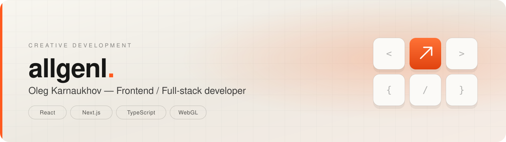

<picture>
  <source media="(prefers-color-scheme: dark)" srcset="assets/banner-dark.svg">
  
</picture>

  

<a href="README.md">Читать по-русски</a> · Moscow · open to new projects

---

## About

I design and build web products end to end — from structure and interface to integrations, deployment and support. Complex logic turned into interfaces people understand.

- **3+ years** in commercial development, **90+** shipped web projects
- Frontend architecture with **React 19 / Next.js 16 / TypeScript** — SSR, RSC, design systems, Storybook
- Backend and data: **Node.js, PHP, Prisma / Drizzle, PostgreSQL, MySQL**
- Integrations: **REST APIs, webhooks, CRM (amoCRM, Bitrix24), payments, analytics**
- A soft spot for expressive frontend: motion, **WebGL / three.js**, interfaces with character

## Stack

**Frontend**

**Backend & data**

**Tooling & process**

## Selected work

| Project | What it is | Stack |
| --- | --- | --- |
| **[allgenl.pro](https://allgenl.pro)** | Personal portfolio: a WebGL keyboard scene, scroll-driven motion, SSR | Next.js · React · three.js |
| **[smartovo.ru](https://smartovo.ru)** | Site for a smart-home service aimed at already-renovated flats | Next.js · React · SSR |
| **[shipileva.ru](https://shipileva.ru)** | Landing page for a preschool teacher: programme, format, sign-up | Next.js · React · SSR |
| **[skinlongevity.ru](https://skinlongevity.ru)** | Editorial project on skin longevity, custom WordPress theme | WordPress · PHP · JS |
| **[mindbox](https://github.com/allgenl/mindbox)** | Open source: todo app with tests · [demo](https://allgenl.github.io/mindbox/) | React · TS · Vite · MUI |

More case studies with context and decisions: <a href="https://allgenl.pro">allgenl.pro</a>.

## What I do

| | |
| --- | --- |
| **Landing & promo sites**   Structure built around the goal, live motion, a form that actually converts | **Corporate sites & catalogues**   Editable content: sections, catalogue, news — all managed from the admin panel |
| **E-commerce**   Storefront, product page, cart, checkout — no unnecessary steps before payment | **Integrations & automation**   Site ↔ CRM, payments, analytics and external services via APIs and webhooks |

## Experience

| Period | Company | Role | Focus |
| --- | --- | --- | --- |
| 2023 — 2026 | **Soft Media Group** | Frontend / Full-stack developer | React products, internal systems, SSR, Storybook, testing and delivery process |
| 2023 | **Roistat** | Integrations developer | Wiring CRM, CMS and analytics together, automating data flow |
| 2023 | **Liga Robotov** | Web developer | Corporate site, responsive interfaces, integrations with internal systems |

## About the repositories

Most of my work lives in private repositories — commercial projects and client code. What can be shown publicly is here; the rest is best seen as the live sites above.

## Get in touch

Tell me about the task — I'll reply, ask the right questions and suggest the next step.

